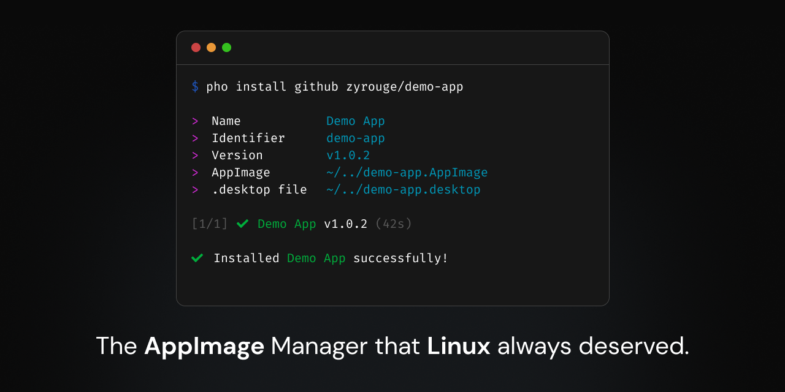

# Phở

    

## Features

-   Manage AppImages by organizing them in a single folder.
-   Integrates AppImages seamlessly. (AppImages must follow AppImage Specification to be integrated with desktop.)
-   Ability to download AppImages from Github Releases and URLs.
-   Supports updation of AppImages. (AppImages fetched from Github Releases only.)
-   Configuration files can be manually edit to further customize functionality.

## Installation

1. All releases can be found [here](https://github.com/zyrouge/pho/releases). Choose a valid release.
2. Binaries are built for 32-bit/64-bit AMD and ARM separately. Download the appropriate one.
3. Rename the downloaded binary to `pho` and place it in a folder that is available in the `PATH` environmental variable. Typically this would be `~/.local/bin`.
4. Run `pho init` to setup necessary configuration.
5. Have fun! 🎉

| Binary name | Platform   |
| ----------- | ---------- |
| `pho-386`   | 32-bit AMD |
| `pho-amd64` | 64-bit AMD |
| `pho-arm`   | 32-bit ARM |
| `pho-arm64` | 32-bit ARM |

## Examples

-   `pho init` - Initialize Pho configuration.
-   `pho install local ./SomeApp.AppImage` - Install and integrate a local AppImage.
-   `pho install github owner/repo` - Download, install and integrate an AppImage from Github Releases.
-   `pho update` - Update all installed AppImages.
-   `pho uninstall some-app` - Uninstall an AppImage.

## Developement

0. Have Install [Go](https://go.dev/) and [Git](https://git-scm.com) installed.
1. Fork and/or Clone this repository.
2. Install dependencies using `go get`.
3. Run the application using `go run main.go`.
4. Build the application using `go build -o ./dist/pho`.

## Contributing

Any kind of contribution including creating issues or making pull requests is welcomed. Make sure to keep it pointful. Sponsorships through [GitHub Sponsors](https://github.com/sponsors/zyrouge) or donations through [Ko-fi](https://ko-fi.com/zyrouge) or [Patreon](https://patreon.com/zyrouge) are welcomed. It helps me to stay motivated.

## License

[MIT](./LICENSE)
